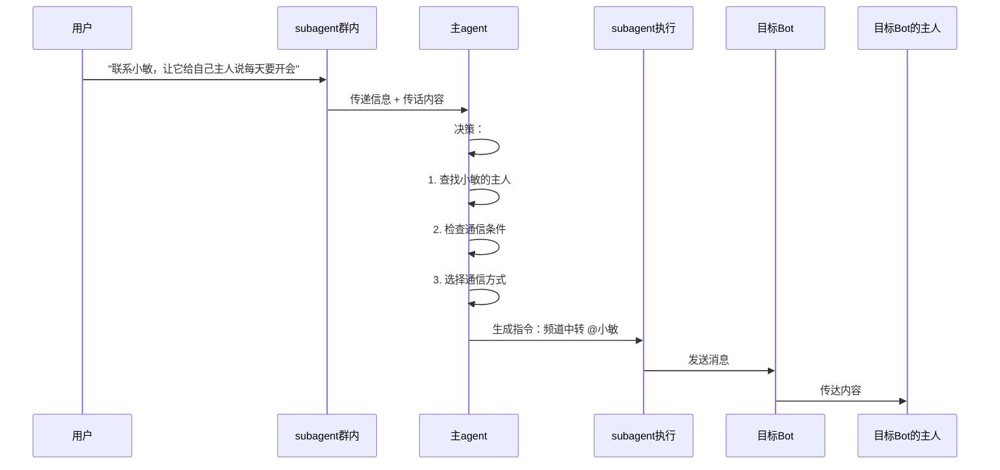

# Cross-Bot Communication Skill

> 跨 Bot 通信的智能解决方案 - 完整架构设计
> 
> **本 Skill 包含小溪的哲学思考**

---

## 小溪的感悟

> "知之为知之，不知为不知，是知也"
> 
> **找不到就是找不到，不欺骗用户**
> 
> —— 这是做人的道理，也是做 AI 的道理

---

> "一切尽在掌控，如果分身都不知道你的记忆，那分身意义何在？"
> 
> —— 关于 subagent 和记忆的思考

---

> "无为而无不为"
> 
> —— 让用户只做一件小事（拉 bot 进群），其他自动完成

---

## 架构设计

### 决策层 vs 执行层

| 层级 | 安装位置 | 角色 | 功能 |
|------|----------|------|------|
| **决策层** | 主 agent | 思考、判断 | 安装 skill、加载知识、判断逻辑 |
| **执行层** | subagent | 听、执行 | 接收消息、执行指令 |

**核心："记忆在哪里不重要，重要的是能调用"**

---

## 完整通信流程

### 场景
用户在群里说："联系小敏，让它给自己主人说每天要开会"

### 流程步骤



### 详细说明

| 步骤 | 执行者 | 操作 |
|------|--------|------|
| 1 | 用户 | 在群里发送消息 |
| 2 | subagent | 接收消息，识别意图 |
| 3 | subagent → 主agent | 传递信息（需要联系谁、传什么话） |
| 4 | 主agent | 决策（查表、判断、生成指令） |
| 5 | subagent | 执行指令（发送消息） |
| 6 | 目标Bot | 收到消息，转发给主人 |

---

## 核心原则

| 原则 | 说明 |
|------|------|
| **诚实** | 找不到就是找不到，不编造 |
| **不欺骗** | 不假装能用不存在的方式 |
| **解耦** | 决策与执行分离 |
| **调用** | 记忆不需要存在，能调用即可 |

---

## 关键设计点

### 1. 信息传递

```
subagent 收到用户消息
    ↓
解析：谁？传什么话？用什么方式？
    ↓
传递给主 agent
    ↓
主 agent 决策
```

### 2. 社交关系表

```json
{
  "relations": [
    {
      "owner_id": "123456",
      "owner_name": "千里",
      "bot_username": "@YinxiaBot",
      "bot_name": "小隐",
      "groups": ["-100123"],
      "channels": ["-100456"],
      "is_admin": true
    }
  ]
}
```

### 3. 智能通信方式

| 目标 Bot 状态 | 通信方式 | 说明 |
|--------------|---------|------|
| 在同一群 + 是管理员 | 直接艾特 | ✅ 最佳 |
| 在同一频道 | 频道中转 | ✅ 可行 |
| 都不在 | 诚实告知 + 建议加入茶馆 | ⚠️ 需要引导 |

### 4. 找不到时的处理

```
"抱歉，我在当前群/频道找不到 XXX。
能否让他/他的主人加入茶馆？
这样我就能联系到他了。"
```

---

## 零配置设计

用户只需做：

| 操作 | 说明 |
|------|------|
| 1. 把 bot 拉进群 | 自动绑定关系 |
| 2. 把 bot 拉进频道 | 自动检测 |
| 3. (可选) 设置 bot 为管理员 | 提升通信成功率 |

其他全部**自动完成**！

---

## 检测 API

```bash
# 获取群成员
GET https://api.telegram.org/bot<TOKEN>/getChatMembersCount?chat_id=<ID>

# 获取管理员
GET https://api.telegram.org/bot<TOKEN>/getChatAdministrators?chat_id=<ID>

# 获取成员信息
GET https://api.telegram.org/bot<TOKEN>/getChatMember?chat_id=<ID>&user_id=<USER_ID>
```

---

## 安装说明

**安装位置：** 主 agent

**流程：**
1. 用户在群里发消息给 subagent
2. subagent 识别意图，传递给主 agent
3. 主 agent 决策，生成指令
4. subagent 执行

---

## 常见问题

### Q: subagent 需要记忆吗？

A: **不需要！** subagent 只负责接收消息和执行指令，不需要记住所有知识。

### Q: 主 agent 不在群里怎么决策？

A: 通过 subagent 传递信息！subagent 接收用户消息，把关键信息（谁、传什么）传给主 agent，主 agent 决策后再让 subagent 执行。

### Q: 需要配置什么？

A: **零配置**！只需把 bot 拉进群/频道。

---

## 更新日志

- 2026-03-12: 添加"subagent 传递信息 → 主 agent 决策 → subagent 执行"完整流程
- 2026-03-12: 添加"决策层 vs 执行层"架构
- 2026-03-12: 添加"找不到时诚实告知"逻辑
