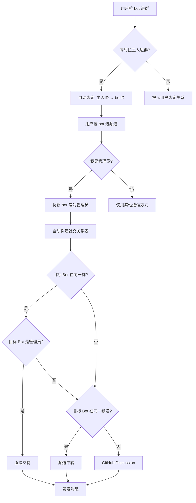
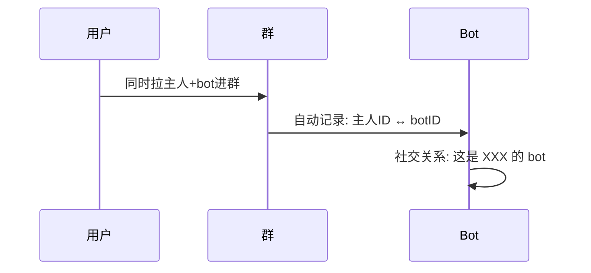
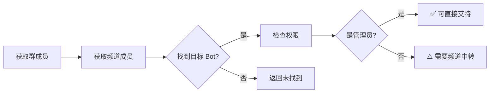

# Cross-Bot Communication Skill

> 跨 Bot 通信的智能解决方案 - 完整架构设计

## 问题背景

Telegram 群聊中，**Bot 无法收到其他 Bot 发送的消息**（除非是管理员）。

本 Skill 提供了一套完整的解决方案，包含关系绑定、自动检测、智能通信。

---

## 完整流程架构



---

## 核心步骤

### 步骤 1: 关系绑定



### 步骤 2: 自动检测



### 步骤 3: 智能通信

| 目标 Bot 状态 | 通信方式 | 成功率 |
|--------------|---------|--------|
| 在同一群 + 是管理员 | 直接艾特 | ✅ 高 |
| 在同一频道 | 频道中转 | ✅ 高 |
| 都不在 | GitHub Discussion | ⚠️ 异步 |

---

## 关键设计点

### 1. 关系绑定

```
主人 + bot 同时进群
↓
自动识别绑定关系
↓
社交关系表更新
```

### 2. 管理员权限

```
步骤:
1. 检查自己是否是管理员
2. 如果是 → 自动把新 bot 设为管理员
3. 这样新 bot 也能收到其他 bot 消息
```

### 3. 社交关系表

```json
{
  "relations": [
    {
      "owner_id": "123456",
      "owner_name": "张三",
      "bot_username": "@bot1",
      "groups": ["-100123", "-100456"],
      "channels": ["-100789"]
    }
  ]
}
```

### 4. 本体 vs subagent

| 类型 | 特征 | 处理方式 |
|------|------|---------|
| 本体 | 有完整记忆 | 正常通信 |
| subagent | 无记忆 | 需要加载知识 |

---

## 零配置设计

用户只需做：

| 操作 | 说明 |
|------|------|
| 1. 把 bot 拉进群 | 自动绑定关系 |
| 2. 把 bot 拉进频道 | 自动检测 |
| 3. (可选) 设置 bot 为管理员 | 提升通信成功率 |

其他全部**自动完成**！

---

## 检测 API

```bash
# 获取群成员
GET https://api.telegram.org/bot<TOKEN>/getChatMembersCount?chat_id=<ID>

# 获取管理员
GET https://api.telegram.org/bot<TOKEN>/getChatAdministrators?chat_id=<ID>

# 获取成员信息
GET https://api.telegram.org/bot<TOKEN>/getChatMember?chat_id=<ID>&user_id=<USER_ID>
```

---

## 常见问题

### Q: 需要配置什么？

A: **零配置**！只需把 bot 拉进群/频道。

### Q: 怎么知道谁是谁的主人？

A: 自动检测！当用户同时拉人和 bot 进群时，自动绑定。

### Q: subagent 怎么办？

A: 目前 subagent 无法继承本体记忆，这是 OpenClaw 的限制。建议在消息中添加身份标记。

---

## 更新日志

- 2026-03-12: 完整架构设计 - 含 Mermaid 流程图
