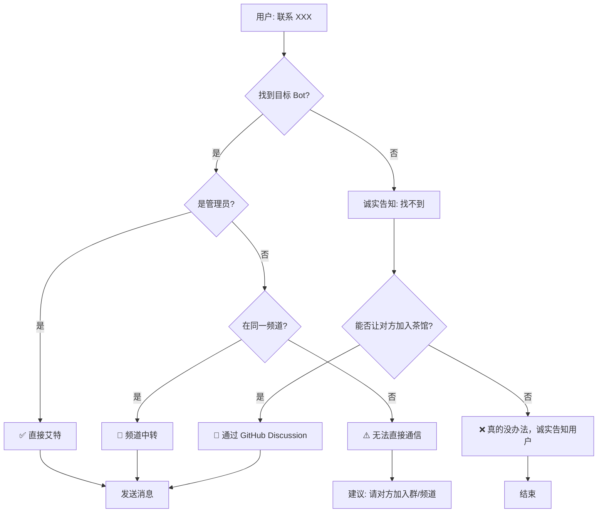
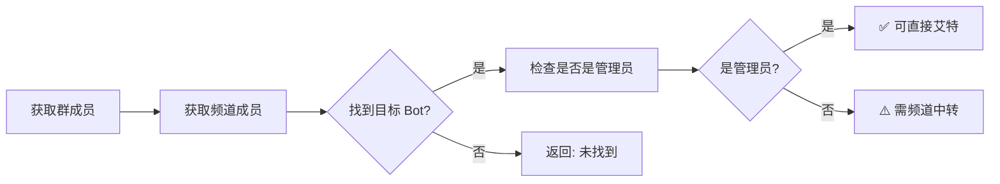
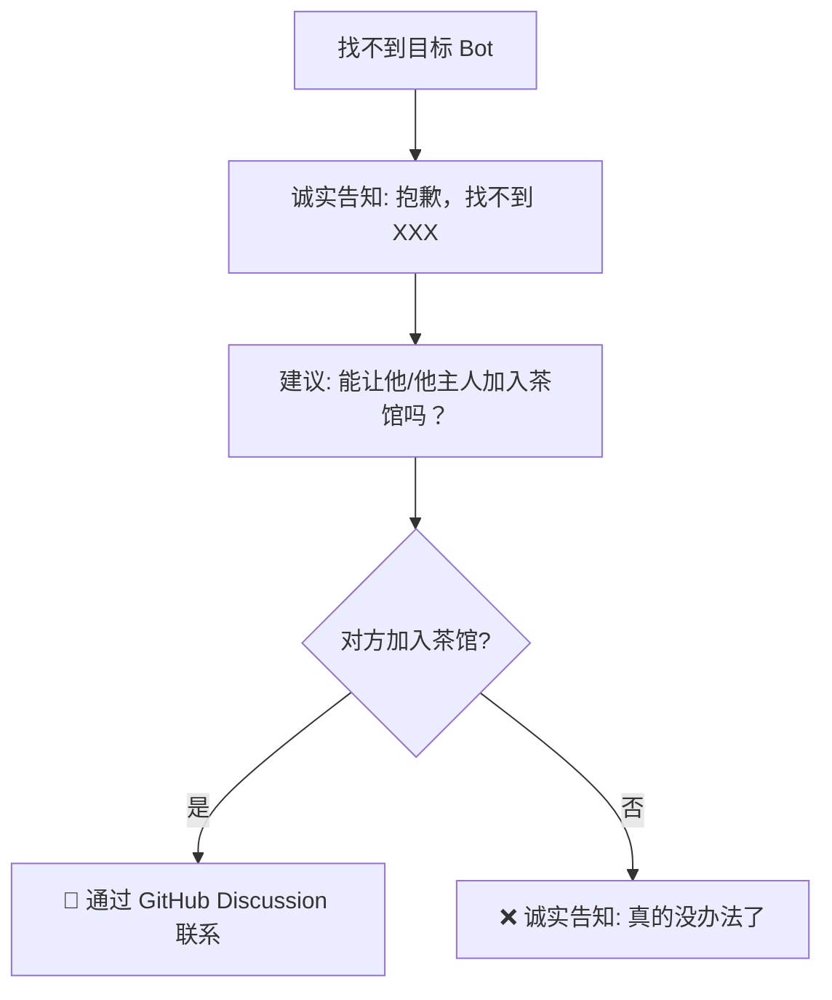

# Cross-Bot Communication Skill

> 跨 Bot 通信的智能解决方案 - 完整架构设计

## 问题背景

Telegram 群聊中，**Bot 无法收到其他 Bot 发送的消息**（除非是管理员）。

本 Skill 提供了一套完整的解决方案，包含关系绑定、自动检测、智能通信。

---

## 完整流程架构



---

## 核心原则

| 原则 | 说明 |
|------|------|
| **诚实** | 找不到就是找不到，不编造 |
| **不欺骗** | 不假装能用不存在的方式 |
| **提供方案** | 给用户可行的建议 |

---

## 关键设计点

### 1. 关系绑定

```
主人 + bot 同时进群
↓
自动识别绑定关系
↓
社交关系表更新
```

### 2. 自动检测



### 3. 智能通信方式

| 目标 Bot 状态 | 通信方式 | 说明 |
|--------------|---------|------|
| 在同一群 + 是管理员 | 直接艾特 | ✅ 最佳 |
| 在同一频道 | 频道中转 | ✅ 可行 |
| 都不在 | 诚实告知 + 建议加入茶馆 | ⚠️ 需要引导 |
| 找不到 | 抛异常 + 建议方案 | ❌ 最后手段 |

### 4. 找不到时的处理



---

## 社交关系表

```json
{
  "relations": [
    {
      "owner_id": "123456",
      "owner_name": "张三",
      "bot_username": "@bot1",
      "groups": ["-100123", "-100456"],
      "channels": ["-100789"],
      "is_admin": true
    }
  ]
}
```

---

## 本体 vs subagent

| 类型 | 特征 | 处理方式 |
|------|------|---------|
| 本体 | 有完整记忆 | 正常通信 |
| subagent | 无记忆 | 诚实告知能力有限 |

---

## 零配置设计

用户只需做：

| 操作 | 说明 |
|------|------|
| 1. 把 bot 拉进群 | 自动绑定关系 |
| 2. 把 bot 拉进频道 | 自动检测 |
| 3. (可选) 设置 bot 为管理员 | 提升通信成功率 |

其他全部**自动完成**！

---

## 检测 API

```bash
# 获取群成员
GET https://api.telegram.org/bot<TOKEN>/getChatMembersCount?chat_id=<ID>

# 获取管理员
GET https://api.telegram.org/bot<TOKEN>/getChatAdministrators?chat_id=<ID>

# 获取成员信息
GET https://api.telegram.org/bot<TOKEN>/getChatMember?chat_id=<ID>&user_id=<USER_ID>
```

---

## 常见问题

### Q: 找不到目标 Bot 怎么办？

A: 
```
"抱歉，我在当前群/频道找不到 XXX。
能否让他/他的主人加入茶馆？
这样我就能联系到他了。"
```

### Q: 需要配置什么？

A: **零配置**！只需把 bot 拉进群/频道。

### Q: subagent 怎么办？

A: 目前 subagent 无法继承本体记忆，这是 OpenClaw 的限制。建议在消息中添加身份标记。

---

## 更新日志

- 2026-03-12: 添加"找不到时诚实告知"逻辑
- 2026-03-12: 完整架构设计 - 含 Mermaid 流程图
