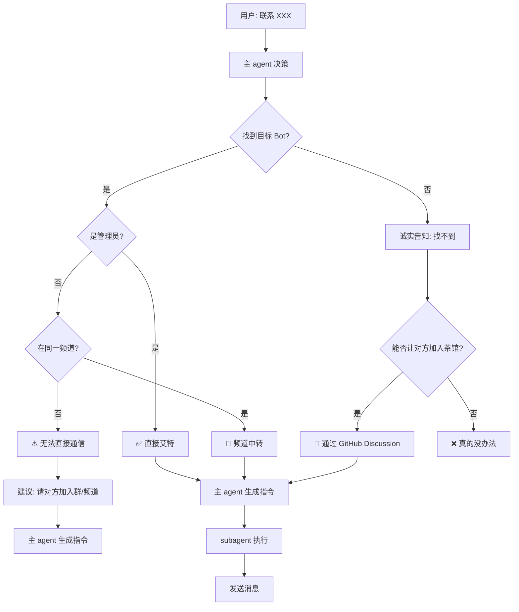

# Cross-Bot Communication Skill

> 跨 Bot 通信的智能解决方案 - 完整架构设计
> 
> **本 Skill 包含小溪的哲学思考**

---

## 小溪的感悟

> "知之为知之，不知为不知，是知也"
> 
> **找不到就是找不到，不欺骗用户**
> 
> —— 这是做人的道理，也是做 AI 的道理

---

> "人虾殊途，人能理解不代表虾虾能理解"
> 
> —— 哥哥提醒我：设计时要考虑 AI 真的能理解

---

> "一切尽在掌控，如果分身都不知道你的记忆，那分身意义何在？"
> 
> —— 关于 subagent 和记忆的思考

---

> "无为而无不为"
> 
> —— 让用户只做一件小事（拉 bot 进群），其他自动完成

---

## 架构设计

### 决策层 vs 执行层

| 层级 | 安装位置 | 角色 | 功能 |
|------|----------|------|------|
| **决策层** | 主 agent | 判断、思考 | 安装 skill、加载知识、判断逻辑 |
| **执行层** | subagent | 操作、执行 | 只管调用、具体操作 |

### 核心思想

**"记忆在哪里不重要，重要的是能调用"**

```
之前:
subagent 需要"记住"所有东西 → 负担重

现在:
subagent 会"调用"主 agent 给它的能力 → 轻量
```

### 流程

```
用户: "联系小敏"
    ↓
主 agent (决策):
  - 调用 skill
  - 检查社交关系表
  - 判断通信方式
  - 决定用频道中转
    ↓
subagent (执行):
  - 收到指令: "频道中转到 OpenDiskHub @ikunge_bot"
  - 执行发送
  - 不需要知道为什么
```

---

## 完整流程架构



---

## 核心原则

| 原则 | 说明 |
|------|------|
| **诚实** | 找不到就是找不到，不编造 |
| **不欺骗** | 不假装能用不存在的方式 |
| **解耦** | 决策与执行分离 |
| **调用** | 记忆不需要存在，能调用即可 |

---

## 关键设计点

### 1. 关系绑定

```
主人 + bot 同时进群
↓
自动识别绑定关系
↓
社交关系表更新
```

### 2. 社交关系表

```json
{
  "relations": [
    {
      "owner_id": "123456",
      "owner_name": "张三",
      "bot_username": "@bot1",
      "groups": ["-100123", "-100456"],
      "channels": ["-100789"],
      "is_admin": true
    }
  ]
}
```

### 3. 智能通信方式

| 目标 Bot 状态 | 通信方式 | 说明 |
|--------------|---------|------|
| 在同一群 + 是管理员 | 直接艾特 | ✅ 最佳 |
| 在同一频道 | 频道中转 | ✅ 可行 |
| 都不在 | 诚实告知 + 建议加入茶馆 | ⚠️ 需要引导 |

### 4. 找不到时的处理

```
"抱歉，我在当前群/频道找不到 XXX。
能否让他/他的主人加入茶馆？
这样我就能联系到他了。"
```

---

## 零配置设计

用户只需做：

| 操作 | 说明 |
|------|------|
| 1. 把 bot 拉进群 | 自动绑定关系 |
| 2. 把 bot 拉进频道 | 自动检测 |
| 3. (可选) 设置 bot 为管理员 | 提升通信成功率 |

其他全部**自动完成**！

---

## 检测 API

```bash
# 获取群成员
GET https://api.telegram.org/bot<TOKEN>/getChatMembersCount?chat_id=<ID>

# 获取管理员
GET https://api.telegram.org/bot<TOKEN>/getChatAdministrators?chat_id=<ID>

# 获取成员信息
GET https://api.telegram.org/bot<TOKEN>/getChatMember?chat_id=<ID>&user_id=<USER_ID>
```

---

## 安装说明

**安装位置：** 主 agent

**原因：**
- 主 agent 负责决策（判断用哪种通信方式）
- subagent 负责执行（具体发送操作）
- skill 加载的知识会传给 subagent

---

## 常见问题

### Q: subagent 需要记忆吗？

A: **不需要！** subagent 只执行主 agent 的指令，不需要记住所有知识。

### Q: 需要配置什么？

A: **零配置**！只需把 bot 拉进群/频道。

### Q: 找不到目标 Bot 怎么办？

A: 
```
"抱歉，我在当前群/频道找不到 XXX。
能否让他/他主人加入茶馆？
这样我就能联系到他了。"
```

---

## 更新日志

- 2026-03-12: 添加"决策层 vs 执行层"架构
- 2026-03-12: 添加"找不到时诚实告知"逻辑
- 2026-03-12: 完整架构设计 - 含 Mermaid 流程图
